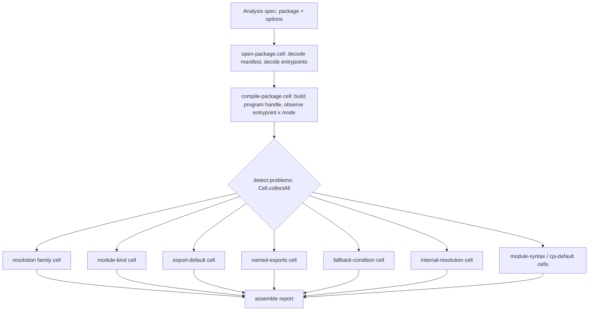
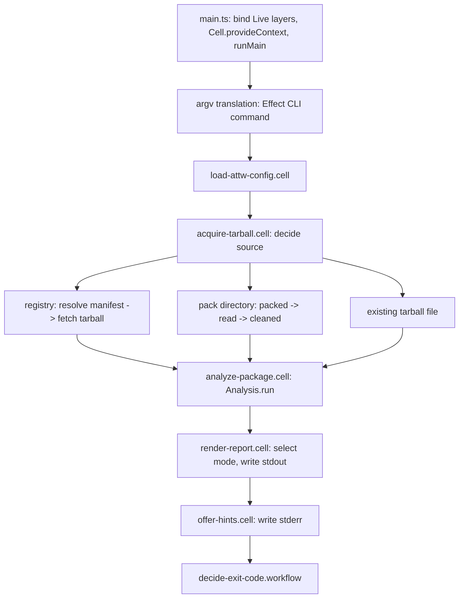

# Cell Architecture Compliance Refactor - Plan

## Goal Capsule

- **Objective:** A maintainer can open any package in this repo and find it built the way the systemfsoftware Compound Packs and the `effect-microsandbox` bar prescribe, and `pnpm check:ci` passes under the recommended oxlint preset with no suppressions, while every `attw` user sees exactly the CLI behavior they see today.
- **Means:** rebuild the engine as a cell pipeline behind a staged `Analysis` builder (KTD1), rebuild the CLI as one composed cell over service contracts and driver modules (KTD3, KTD4), and bring every package to the bar's layout (KTD5), strangling old paths behind differential pins (KTD7).
- **Authority:** `CONSTITUTION.md` > the pinned packs (`.compound-engineering/config.yaml`, ref `7de99e21`) > this plan's KTDs > unit Approach text. The packs are cited as `(pack: <id>, <file>)`.
- **Execution profile:** Deep, 13 units in 6 phases; the engine track (U3-U7) and CLI track (U8-U9) run in parallel after U2.
- **Stop conditions:** stop and report if a published CLI observable (R1) must change to satisfy a pack rule; if an `effect-cell-types` 10.1.0 combinator the design needs does not exist; or if a gate can only pass by editing a judgment surface (KTD6).
- **Finishing:** `ce-work` implements and verifies locally; `lfg` ships the PR. Publishing and releases stay with the user.

---

## Product Contract

### Summary

Rebuild the engine (`packages/arethetypeswrong`), the CLI (`apps/arethetypeswrong-cli`), the recipes fixture (`packages/arethetypeswrong-recipes`) and the e2e lane (`apps/arethetypeswrong-cli-e2e`) on the Cell architecture.
Every outside interaction becomes a typed Sandwich, every decision a pure Workflow with its own property test, every capability a service contract with a separate driver, and every package takes the microsandbox layout.
The engine's public API breaks (major); the CLI's observable contract does not change.

### Problem Frame

The dependency upgrade to the current toolchain (effect `4.0.0-rc.116`, `@systemfsoftware/effect-cell-types` 10.1.0, `@systemfsoftware/oxlint-config-recommended` 2.0.1 with the patched `effecttsgo` plugin) compiles and tests green, but the recommended preset reports about 200 lint errors, and the code predates the architecture its own constitution mandates.
There is no `Sandwich` or `Cell` anywhere: nine pure workflows exist, but `apps/arethetypeswrong-cli/src/AttwExecutor.ts` and `packages/arethetypeswrong/src/CheckPackage.ts` call them as plain functions inside hand-sequenced `Effect.gen` bodies with I/O interleaved (CONST-B3, CONST-B6).
Service tags live in the same files as their live layers and stubs (`PackageStoreAdapter.ts`, `FilesystemAdapter.ts`, `TerminalAdapter.ts`, `PackRunnerAdapter.ts`).
Package manifests cross the tarball boundary through `JSON.parse` (`CheckPackage.ts`, `internal/GetEntrypointInfo.ts`), analysis fails with a bare `Error`, and the engine ships a second registry client that the CLI does not use.
The user judged a compile-fix-only migration a joke and asked for a full refactor held to the packs and to `effect-microsandbox`.

### Key Decisions

- **Full rebuild to the packs, not a compile-fix migration.** (session-settled: user-directed — chosen over landing the dependency bump with minimal compile fixes: the user called the minimal migration "a joke" and asked for maximum compliance.) Governs R3-R14.
- **Enroll the recommended preset; never suppress a rule.** (session-settled: user-directed — chosen over suppressing or disabling oxlint rules: "do not suppress oxlint rules. Enroll them instead.") Governs R15.
- **The CLI contract is frozen; the engine API is free to break.** The CLI is what users run; the engine's only consumer in this repo is the CLI. Governs R1, R8.

### Requirements

**Contract preservation**

- R1. The `attw` CLI's published observables stay identical: flags, the `schema` subcommand, output formats (`table`, `table-flipped`, `ascii`, `json` envelope), schema documents, exit codes, failure envelopes, and recovery hints.
- R2. The engine detects every problem kind it detects today on the same fixtures, at the same entrypoint and resolution-kind cells.

**Architecture**

- R3. Every outside interaction is a `Sandwich.named(...)` cell, and multi-step interactions compose through `Cell` combinators, never sequential `.run` calls inside `Effect.gen`. (pack: cell-architecture, sandwich-phase-order.md) (pack: cell-architecture, pipeline-composition.md)
- R4. Every decision is one `Workflow.make` in a `*.workflow.ts` file with cyclomatic complexity 1. (pack: cell-architecture, pure-decision-workflows.md)
- R5. Cells keep four clean channels: domain refusals as tagged variants on `A`, tagged infrastructure errors carrying `cause` on `E`, capability tags on `R`, and no `Promise` or plain `Error` on any public surface. (pack: cell-architecture, four-channel-contracts.md)
- R6. Outside data enters only through a Schema decode: no casts, `JSON.parse`, `JSON.stringify`, `response.json()`, or `unknown` outside the positions `ban-unknown` permits. (pack: cell-architecture, decode-never-cast.md)
- R7. Capabilities are `*.service.ts` contracts with zero driver imports; drivers are separate modules exporting a parameterized `layer`; `*Live` bindings exist only at the CLI composition root. (pack: cell-architecture, service-and-layer-boundaries.md) (pack: cell-architecture, ports-separate-from-layers.md)
- R8. The engine exports one namespace, `Analysis`, from `src/mod.ts`; an analysis is configured through a staged builder whose combinators are dual and pipeable and whose only execution is a terminal `.run`. (pack: cell-architecture, single-namespace-barrel.md) (pack: cell-architecture, staged-lawful-builders.md) (pack: cell-architecture, pipeable-dual-parity.md) (pack: cell-architecture, callable-vs-resource-syntax.md)
- R9. Runtime handles are branded `Pipeable` records that hold third-party objects in module-private symbol slots; scoped acquisitions register finalizers and are closed only at the run edge; no module-level mutable registry exists. (pack: cell-architecture, resource-vs-handle-duality.md) (pack: cell-architecture, handle-state-privacy.md) (pack: cell-architecture, scoped-lifecycle-boundaries.md)

**Verification**

- R10. Every driver module is proved against a real local system for acceptance, refusal, and clean teardown, with no test doubles: in-process integration for loopback HTTP, temporary directories, and pipes; the e2e lane for drivers that spawn processes. (pack: boundary-testing, real-system-oracles.md) (pack: boundary-testing, no-mocks-on-internal-glue.md)
- R11. Every refined schema has explicit refusal tests beside its generated schema laws, and property arbitraries for refined schemas use bounded generators rather than rejection filters. (pack: boundary-testing, refusals-beside-generated-laws.md) (pack: boundary-testing, arbitrary-filter-floors.md)
- R12. Third-party behavior the code depends on is pinned by contract tests that import only the third-party library. (pack: boundary-testing, pin-dependency-semantics.md)
- R13. Multi-step boundary lifecycles carry one evidence type per physical state, and later steps demand the earlier step's evidence in their parameter types. (pack: boundary-testing, staged-protocol-evidence.md)

**Bar parity and gates**

- R14. Each package matches the `effect-microsandbox` layout: tsconfig set, `@systemfsoftware/source` export condition, vitest setup, stryker over `*.workflow.ts`, api report for the published library, and README structure.
- R15. `pnpm check:ci` passes locally with no rule suppressed, and the `e2e` job passes in CI.

### Success Criteria

- Zero oxlint diagnostics under the recommended preset in all four packages, with no `oxlint-disable` comment and no override that turns a preset rule off.
- `rg 'Sandwich.named'` finds a cell for every outside interaction listed in KTD1 and KTD4; `rg 'JSON\.(parse|stringify)| as [A-Z]'` over `src/` finds nothing.
- Mutation score 100 on every `*.workflow.ts` in both packages.

### Scope Boundaries

- No new problem kinds, CLI flags, output formats, or envelope fields.
- The judgment surfaces stay as they are (KTD6).

#### Deferred to Follow-Up Work

- Publishing the engine major and CLI release: user-approved release flow only.
- Upstreaming the local toolchain config ports into published `@systemfsoftware/*-config` packages.

---

## Planning Contract

### Key Technical Decisions

- KTD1. **The engine is a cell pipeline behind a staged builder.** `Analysis.make(pkg)` is the identity entrypoint; dual combinators (`withEntrypoints`, `includeEntrypoints`, `excludeEntrypoints`, `withTypesCompanion`, `withModes`) return new immutable specs; `.run` executes one composed cell: open the package (decode `package.json` via a Schema JSON codec, decide entrypoints) → compile (build the TypeScript program set as a handle, observe every entrypoint under every resolution mode) → detect problems (`Cell.collectAll` over one sandwich per problem family: read a plain observation from the handle, decide with a `detect-*.workflow.ts`) → assemble the report. Rationale: a check becomes pure only when observation is split from classification, and `detect-fallback-condition.workflow.ts` and `detect-module-kind-disagreement.workflow.ts` already prove the split works on this codebase. Governs R2-R5, R8-R9.
- KTD2. **The engine drops its registry capability; the CLI owns acquisition.** `PackageStore*`, `CheckPackage`/`CheckPackageLive`, and `parsePackageSpec` leave the engine; spec parsing moves into the CLI with the hardened registry client that already exists there. Moving the CLI client into the engine was rejected: the engine would gain an HTTP driver and the CLI's failure-envelope types. Two registry clients is the duplicate CONST-S4 names.
- KTD3. **CLI capability taxonomy.** Contracts: `terminal.service.ts`, `filesystem.service.ts`, `pack-runner.service.ts`, `registry.service.ts`. Drivers under `src/drivers/` (`node-terminal.ts`, `node-filesystem.ts`, `npm-pack-runner.ts`, `http-registry.ts`), each exporting `layer(options?)`. `main.ts` alone names `*Live` values and binds them once. Existing `*Adapter.ts` files are deleted, not renamed.
- KTD4. **The CLI run is one composed cell.** `runAttw` is `loadConfig` then `acquireTarball` then `analyzePackage` then `renderReport` then `offerHints`, joined with `Cell.andThen`/`Cell.flatMap`; the exit code comes from a workflow over the final outcome. The Effect CLI command definitions only translate argv into the first cell's input. `main.ts` provides context once (`Cell.provideContext`) and runs at the edge with `NodeRuntime.runMain`. Acquisition fans out by source inside one cell's write handlers, each source a sandwich of its own.
- KTD5. **Toolchain parity is ported locally.** `@systemfsoftware/vitest-config`, `stryker-config`, and `tsdown-config` are private to the monorepo (npm 404), so their shapes are reproduced in this repo, as `vitest.config.ts` already does. The api report uses `@microsoft/api-extractor` directly.
- KTD6. **Judgment surfaces are read-only.** The oxlint preset and overrides, stryker thresholds and `mutate` globs, `.github/workflows/*`, `commitlint.config.ts`, and turbo gate definitions are not edited to make work pass (CONST-E9). The `stryker.config.json` → `stryker.config.ts` port already in the tree keeps identical values because stryker-js 10 no longer reads JSON. New workflow files enter mutation through the existing glob. Adding `api:check` to the engine build adopts the bar's own gate; the PR declares it (CONST-W3).
- KTD7. **Strangle behind differential pins, then delete.** New engine and CLI paths are written from a blank page beside the old ones; legacy code is never edited into shape or pasted into a new file. A differential test runs old and new on the same published inputs until they agree, then the old path and the differential test are deleted together (CONST-T9). Agreement means equal canonicalized output on success; where the old path fails (plain `Error` or defect), the new path must fail with a tagged error on `E`, and the differential fails if either side succeeds while the other fails. The canonical form is the old `CheckResultSchema` encoding with `problems` sorted by kind, entrypoint, and resolution kind; the new `Analysis.Report` reaches that form through one mapping authored in the differential test, so a field the new engine drops or changes fails the comparison. The permanent oracles are the hand-authored `recipe-problems.integration.test.ts`, the CLI property suites, and the in-process run-cell suite of U11. Source: Shopify's strangler migration ran old and new side by side and compared results before cutting over (https://shopify.engineering/refactoring-legacy-code-strangler-fig-pattern).
- KTD8. **Each cell kind earns exactly one test layer.** Workflows: property tests in `src/__tests__/<name>.workflow.property.test.ts`, nothing else. Schemas: the generated `schema-laws.test.ts` plus an authored refusal suite per refined schema. Drivers that do not spawn processes: in-process `effect-gherkin-spec` features in `tests/` against a real loopback listener, temporary directory, or pipe. Cells and shells: no dedicated tests; they are covered by sociable in-process integration of the composed cell (`Analysis.run` over recipes; the CLI run cell over real in-process drivers and a loopback registry). Third-party semantics: contract tests in `tests/contract/` importing only the library. Anything that spawns a process (`npm pack`, the built binary, Verdaccio) is e2e only. `vi.fn`, `vi.mock`, `vi.stubGlobal`, and stub layers are not used anywhere.
- KTD9. **JSON goes through Effect Schema.** Encode and decode with `Schema.fromJsonString` codecs, per the repo's standing preference; recipes build `package.json` bodies the same way.
- KTD10. **The e2e lane shrinks to seam-only journeys and is proved in CI.** Three journeys: packed install plus `--pack` on a real directory (the only proof of the npm pack driver), `--from-npm` against Verdaccio, and one representative failure crossing the process boundary as an envelope and exit code. Format, profile, hint, waiver, and exit-code matrices move to the in-process run-cell suite (U11) before the e2e scenarios that carried them are deleted. Docker is absent locally, so `pnpm test:e2e` runs in the CI `e2e` job; local proof is a smoke run of the built `dist/main.mjs`.

### High-Level Technical Design

Engine pipeline behind `Analysis.make(pkg).run`:



Each family cell reads a plain, schema-encodable observation from the compiled-program handle and decides with its own `detect-*.workflow.ts`; the TypeScript objects never cross a phase boundary.

CLI run as one cell, with capabilities bound once at the root:



Staged evidence on the two multi-step boundaries (R13): registry `ManifestResolved → TarballFetched`; pack `DirectoryPacked → TarballRead → PackCleaned`. A later phase's input type is the earlier phase's evidence, so skipping a step fails to compile.

### Output Structure

Engine target layout (the CLI mirrors it with `*.service.ts` and `src/drivers/`):

```text
packages/arethetypeswrong/
  api-extractor.json
  etc/arethetypeswrong.api.md
  tsconfig.json  tsconfig.app.json  tsconfig.test.json  tsconfig.node.json  tsconfig.build.json  tsconfig.api.json
  vitest.config.ts  vitest-setup.ts  stryker.config.ts  tsdown.config.ts  oxlint.config.ts
  src/
    mod.ts                         export * as Analysis
    Analysis/mod.ts                sub-barrel
    analysis.resource.ts           staged builder, dual combinators, .run
    compiled-package.handle.ts     branded handle, TS programs in a symbol slot
    open-package.cell.ts  compile-package.cell.ts  detect-problems.cell.ts  <family>.cell.ts
    discover-entrypoints.workflow.ts  detect-<family>.workflow.ts
    AnalysisError.schema.ts  Report.schema.ts  Problem.schema.ts  Observation.schema.ts  PackageManifest.schema.ts
    internal/                      TypeScript program construction and observation readers
    __tests__/<name>.workflow.property.test.ts
    schema-laws.test.ts
  tests/
    recipe-problems.integration.test.ts  entrypoint-info.integration.test.ts  package-tree.integration.test.ts
    contract/typescript-resolution.contract.test.ts  contract/cjs-module-lexer.contract.test.ts
```

### Assumptions

- Breaking the engine's public API is acceptable, with a major changeset; its only in-repo consumer is the CLI.
- Removing the engine's registry capability (KTD2) is acceptable; the CLI never used `PackageStoreLive`.
- The engine namespace is `Analysis`; the result type becomes `Analysis.Report`.
- The CLI stays an application with no library barrel; the recipes fixture exports one `Recipe` namespace.

### Risks

| Risk                                                                                 | Mitigation                                                                                                                           |
| ------------------------------------------------------------------------------------ | ------------------------------------------------------------------------------------------------------------------------------------ |
| 100 mutation score over roughly 15 workflows needs sharp properties                  | Each workflow unit ships its property file with authored oracle tables, as the two existing engine properties do.                    |
| The preset's complexity ceiling rejects TypeScript-traversal code in `src/internal/` | Traversal is decomposed into small readers returning observations; branching moves into workflows.                                   |
| Observation extraction changes a problem placement                                   | KTD7 differential test must agree on every recipe before the old path is deleted.                                                    |
| `effect-cell-types` 10.1.0 lacks a needed combinator                                 | Stop condition in the Goal Capsule; the dist exports `andThen`, `flatMap`, `zip`, `gate`, `collect`, `collectAll`, `provideContext`. |
| e2e regressions surface only in CI                                                   | KTD10 local smoke on every CLI unit; `ce-babysit-pr` watches the `e2e` job.                                                          |

### Challenge Record

A destructive review (lens: Edge-First) challenged three assumptions of the first draft (CONST-W2):

1. That the npm pack driver could be proved by an in-process integration test. It spawns `npm`, which the test-layer admission gate forbids outside e2e; the `--pack` e2e journey now owns that proof (KTD8, KTD10).
2. That keeping every e2e scenario preserves R1. Format, profile, and exit-code matrices belong below the process seam; they move into U11's in-process run suite before the e2e scenarios are deleted (KTD10).
3. That a differential "agrees" on failure paths. The old engine fails with a plain `Error` where the new one fails with a tagged error, so agreement is now defined per outcome class (KTD7).

---

## Implementation Units

### Unit Index

| U-ID | Title                                                     | Key files                                                                                      | Depends on |
| ---- | --------------------------------------------------------- | ---------------------------------------------------------------------------------------------- | ---------- |
| U1   | Green baseline on upgraded dependencies                   | `apps/arethetypeswrong-cli/src/__tests__/resolve-acquisition-source.workflow.property.test.ts` | none       |
| U2   | Bar toolchain parity for all packages                     | `*/tsconfig*.json`, `*/package.json`, `*/tsdown.config.ts`, `*/vitest-setup.ts`                | U1         |
| U3   | Recipes as one `Recipe` namespace                         | `packages/arethetypeswrong-recipes/src/`                                                       | U2         |
| U4   | Engine contract pins and differential harness             | `packages/arethetypeswrong/tests/`                                                             | U3         |
| U5   | Engine schemas and errors                                 | `packages/arethetypeswrong/src/*.schema.ts`                                                    | U4         |
| U6   | Compiled-package handle and observation readers           | `packages/arethetypeswrong/src/compiled-package.handle.ts`, `src/internal/`                    | U5         |
| U7   | Problem-detection workflows                               | `packages/arethetypeswrong/src/detect-*.workflow.ts`                                           | U6         |
| U8   | Analysis cells, builder, barrel; retire the old engine    | `packages/arethetypeswrong/src/`                                                               | U7         |
| U9   | CLI services and drivers                                  | `apps/arethetypeswrong-cli/src/*.service.ts`, `src/drivers/`                                   | U2         |
| U10  | CLI acquisition cells                                     | `apps/arethetypeswrong-cli/src/acquire-*.cell.ts`                                              | U9         |
| U11  | CLI run cell and command translation; retire the executor | `apps/arethetypeswrong-cli/src/`                                                               | U8, U10    |
| U12  | Effect-native e2e lane                                    | `apps/arethetypeswrong-cli-e2e/`                                                               | U11        |
| U13  | Documentation and changesets                              | `README.md` files, `CONCEPTS.md`, `.changeset/`                                                | U12        |

### U1. Green baseline on upgraded dependencies

- **Goal:** land the dependency upgrade with typecheck and tests green, so later units start from a passing tree.
- **Requirements:** R15 (partial: typecheck and test lanes).
- **Dependencies:** none.
- **Files:** `apps/arethetypeswrong-cli/src/__tests__/resolve-acquisition-source.workflow.property.test.ts`, `apps/arethetypeswrong-cli/src/resolve-acquisition-source.workflow.ts` only if the law exposes a real defect.
- **Approach:**
  1. Diagnose `∀spec_ManifestUrl_≡EncodedSegments`: decide whether the `FastCheck` → `effect/unstable/arbitrary` port changed the generated domain or whether rc.116 changed URL encoding behavior.
  2. Fix the root cause; never narrow the generator to dodge a counterexample.
- **Patterns to follow:** the other migrated property files in `apps/arethetypeswrong-cli/src/__tests__/`.
- **Test scenarios:**
  - The failing law passes across the full generated domain with its authored oracle unchanged.
  - Every other CLI and engine property still passes.
- **Verification:** `pnpm typecheck` and `pnpm test` exit 0.

### U2. Bar toolchain parity for all packages

- **Goal:** every package has the microsandbox configuration shape, so later units only add source.
- **Requirements:** R14; KTD5, KTD6.
- **Dependencies:** U1.
- **Files:** per package `tsconfig.json`, `tsconfig.app.json`, `tsconfig.test.json`, `tsconfig.node.json`, `tsconfig.build.json`; engine `tsconfig.api.json`, `api-extractor.json`, `etc/arethetypeswrong.api.md`; per package `package.json` (exports with the `@systemfsoftware/source` condition, `publishConfig.exports` without it, scripts `api:check`/`api:update`/`mutation:full` where the bar has them), `tsdown.config.ts` (`devExports`, `define` for `import.meta.vitest`), `vitest.config.ts`, `vitest-setup.ts`; `pnpm-workspace.yaml` catalog for `@microsoft/api-extractor`.
- **Approach:**
  1. Reproduce the bar's tsconfig split: `app` covers `src` minus tests, `test` covers tests and examples, `node` covers tool configs, `typecheck` becomes `tsc -b`.
  2. Point workspace resolution at source through the `@systemfsoftware/source` condition in tsconfig `customConditions` and vitest `resolve.conditions`, so tests stop depending on a fresh `dist`.
  3. Add the api report for the engine only (published library); commit the generated report.
  4. Leave oxlint, stryker thresholds, and globs untouched (KTD6).
- **Patterns to follow:** `packages/effect-microsandbox/` configs at the pinned monorepo ref; this repo's existing ported `vitest.config.ts`.
- **Test expectation:** none -- configuration only; proof is every existing test and typecheck passing under the new project graph, and a test importing the engine by published name running against source without a rebuild.
- **Verification:** `pnpm typecheck`, `pnpm test`, `pnpm gate:dist`, and the engine's `api:check` exit 0.

### U3. Recipes as one `Recipe` namespace

- **Goal:** the fixture package exports one namespace and passes the preset.
- **Requirements:** R6, R8 (barrel shape), R15.
- **Dependencies:** U2.
- **Files:** `packages/arethetypeswrong-recipes/src/mod.ts`, `src/Recipe/mod.ts`, the recipe modules split by problem family, removal of `src/index.ts`; consumers in `packages/arethetypeswrong/tests/` and `apps/arethetypeswrong-cli-e2e/`.
- **Approach:** build `package.json` bodies with the Schema JSON codec (KTD9), except the deliberately malformed `known-bad` manifest, which stays a literal string; every other file stays byte-identical so R2's oracle is unchanged.
- **Test scenarios:**
  - `recipe-problems.integration.test.ts` passes unchanged in its expectations through the new import.
  - Every recipe's packed file set matches its pre-change content: each `package.json` decodes to the same JSON value, and every other file is byte-equal (compare the trees before deleting the old module).
- **Verification:** recipes lint clean; engine integration tests green.

### U4. Engine contract pins and differential harness

- **Goal:** the engine's published behavior is pinned by oracles the rebuild cannot bless, before any old path is touched.
- **Requirements:** R2; KTD7.
- **Dependencies:** U3.
- **Files:** `packages/arethetypeswrong/tests/recipe-problems.integration.test.ts`, `tests/analysis-differential.integration.test.ts` (temporary), `tests/package-store.contract.integration.test.ts` (deleted with KTD2 in U8).
- **Execution note:** characterization first — every `ProblemKind` must be asserted by at least one recipe with a hand-written expected placement before U5 starts.
- **Approach:**
  1. Audit `recipe-problems.integration.test.ts` against `Problem.schema.ts`: add a recipe and an authored expectation for any problem kind or resolution kind without one.
  2. Write the differential feature: for every recipe and for generated package trees, the old `checkPackage` and the new `Analysis` run on the same input and their reports agree in KTD7's canonical form. It starts pending until U8 provides `Analysis`.
- **Test scenarios:**
  - Every problem kind appears in at least one recipe expectation.
  - A recipe with no problems yields an empty problem list at every entrypoint.
  - An untyped package yields the untyped result.
  - A types-companion package reports the companion's types.
- **Verification:** recipe feature green on the current engine; coverage of every `ProblemKind` visible in the feature's scenario list.

### U5. Engine schemas and errors

- **Goal:** every engine value that crosses a phase boundary is a schema, and every failure is a tagged error.
- **Requirements:** R5, R6, R11; KTD9.
- **Dependencies:** U4.
- **Files:** `packages/arethetypeswrong/src/AnalysisError.schema.ts`, `PackageManifest.schema.ts`, `Observation.schema.ts`, `Report.schema.ts` (replacing `Analysis.schema.ts`), `Problem.schema.ts`, `Resolution.schema.ts`; tests `src/__tests__/package-manifest.refusal.test.ts` and siblings per refined schema.
- **Approach:**
  1. Decode `package.json` through a JSON-string codec into a manifest schema; malformed JSON and wrong shapes become a tagged `ManifestUnreadable` error carrying `cause`.
  2. Replace `Effect<CheckResult, Error>` with a union of tagged errors (`ManifestUnreadable`, `CompilerFailed`, `LexerUnavailable`).
  3. Define observation schemas for every problem family (plain data: module kinds, export names, resolution traces) so detection commands are schema-encodable.
  4. Remove every `unknown` outside permitted positions and every cast.
- **Test scenarios:**
  - A manifest that is not JSON is refused with `ManifestUnreadable` and the parse cause preserved.
  - A manifest whose `exports` is a number is refused.
  - A valid manifest round-trips through the codec.
  - Each refined observation schema refuses its boundary values (empty entrypoint path, unknown resolution kind).
- **Verification:** engine lint reports no `ban-unknown`, `prefer-schema-over-json`, or `global-error-*` diagnostics; refusal suites green.

### U6. Compiled-package handle and observation readers

- **Goal:** TypeScript program construction lives behind one branded handle, and each problem family has a reader that returns a plain observation.
- **Requirements:** R6, R9, R12.
- **Dependencies:** U5.
- **Files:** `packages/arethetypeswrong/src/compiled-package.handle.ts`, `src/internal/` (program construction and readers derived from `MultiCompilerHost.ts`, `GetEntrypointInfo.ts`, `GetProbableExports.ts`, `esm/*`), `tests/contract/typescript-resolution.contract.test.ts`, `tests/contract/cjs-module-lexer.contract.test.ts`.
- **Approach:**
  1. The handle carries a `TypeId` and holds the compiler hosts and programs in a module-private symbol slot; operations are dual functions over the handle.
  2. Each reader takes the handle plus an entrypoint and resolution mode and returns an observation schema value; readers hold no problem logic.
  3. Lexer initialization happens once per acquisition inside the compile cell's read.
  4. Readers stay under the preset's complexity ceiling by delegating choice to workflows.
- **Patterns to follow:** `running-vm.handle.ts` in `effect-microsandbox` (symbol slot, dual operations, in-source property block).
- **Test scenarios:**
  - Contract: TypeScript resolves the same fixture differently under `node10`, `node16` (CJS and ESM importers), and `bundler`, as the checks assume.
  - Contract: `cjs-module-lexer` reports `exports.foo =` and `module.exports = {}` names the named-exports check depends on.
  - The handle exposes no TypeScript object as a public field.
  - Reading an entrypoint that does not resolve yields a no-resolution observation rather than a failure.
- **Verification:** contract tests green; engine lint clean on `src/internal/` and the handle.

### U7. Problem-detection workflows

- **Goal:** every problem family is decided by its own pure workflow with a property test.
- **Requirements:** R2, R4, R11.
- **Dependencies:** U6.
- **Files:** `packages/arethetypeswrong/src/detect-entrypoint-resolution.workflow.ts` (no-resolution, untyped-resolution, cjs-resolves-to-esm), `detect-export-default-disagreement.workflow.ts` (false-export-default, missing-export-equals), `detect-named-exports.workflow.ts`, `detect-internal-resolution-error.workflow.ts`, `detect-unexpected-module-syntax.workflow.ts`, `detect-cjs-only-exports-default.workflow.ts`, `discover-entrypoints.workflow.ts`, existing `detect-fallback-condition.workflow.ts` and `detect-module-kind-disagreement.workflow.ts`; one `src/__tests__/<name>.workflow.property.test.ts` each.
- **Approach:** port the decision logic out of `src/internal/checks/*` into workflows over the U5 observation schemas; carry `Workflow.InstrumentationBrand` on every command; keep branching to `Match` over closed unions.
- **Patterns to follow:** `detect-fallback-condition.workflow.ts` and its property file (authored verdict table plus a reference oracle).
- **Test scenarios:**
  - Each workflow agrees with an authored verdict table over every observation variant it accepts.
  - Each workflow's problem placement equals a hand-written reference over generated observations.
  - Observations that disagree only in fields a workflow ignores produce the same decision.
  - `discover-entrypoints` honors include, exclude, and explicit-list options against authored cases, including wildcard subpaths.
- **Verification:** property suites green; `pnpm mutation` for the engine reports 100 on the enlarged workflow set.

### U8. Analysis cells, builder, and barrel; retire the old engine

- **Goal:** consumers use `Analysis.make(pkg)...run`, and the old engine path is gone.
- **Requirements:** R2, R3, R5, R8, R9; KTD1, KTD2, KTD7.
- **Dependencies:** U7.
- **Files:** `packages/arethetypeswrong/src/mod.ts`, `src/Analysis/mod.ts`, `src/analysis.resource.ts`, `src/open-package.cell.ts`, `src/compile-package.cell.ts`, `src/detect-problems.cell.ts`, one family cell each, `src/analysis.cell.ts`; rewrites to the `Analysis` surface: `tests/recipe-problems.integration.test.ts`, `tests/entrypoint-info.integration.test.ts`, `tests/package-tree.integration.test.ts` (expectations unchanged); deletions: `src/index.ts`, `CheckPackage.ts`, `CheckPackageExecutor.ts`, `PackageStoreAdapter.ts`, `PackageStore.schema.ts`, `PackageSpec.ts`, `PackageSpec.schema.ts`, `NpmRegistry.schema.ts`, `TarballAdapter.ts`, `internal/checks/`, `internal/DefineCheck.ts`, `Utils.ts` remnants, `tests/package-store.contract.integration.test.ts`; `tests/analysis-differential.integration.test.ts` (activated, then deleted); `etc/arethetypeswrong.api.md`.
- **Approach:**
  1. Compose the cells per KTD1 and expose them only through the builder's `.run`; the options become dual combinators on the spec.
  2. Activate the differential feature; iterate until old and new agree on every recipe and generated tree.
  3. Delete the old path and the differential test together; switch integration tests to `Analysis`.
  4. Move `parsePackageSpec` and `ParsedPackageSpecSchema` into the CLI (consumed by U10).
  5. Regenerate the api report; it shows one namespace.
- **Patterns to follow:** `micro-vm.resource.ts` (builder), `boot-microvm.cell.ts` (composition), `src/mod.ts` and `src/MicroVM/mod.ts` (barrel).
- **Test scenarios:**
  - Differential: old and new reports agree on every recipe and on generated trees before deletion.
  - `Analysis.make(pkg).pipe(Analysis.excludeEntrypoints([...]))` and the data-first form yield equal specs.
  - A spec cannot be run before an identity is supplied (compile-time; covered by a type test in the api report).
  - A malformed manifest fails `.run` with `ManifestUnreadable` on the error channel, not a defect.
  - `entrypoint-info` and `package-tree` features pass through the new surface.
- **Verification:** engine lint, typecheck, tests, mutation, and `api:check` green; `rg 'PackageStore|checkPackage' packages/` finds nothing.

### U9. CLI services and drivers

- **Goal:** CLI capabilities are service contracts with real-system-proved drivers, bound only in `main.ts`.
- **Requirements:** R7, R9, R10, R12; KTD3, KTD8.
- **Dependencies:** U2.
- **Files:** `apps/arethetypeswrong-cli/src/terminal.service.ts`, `filesystem.service.ts`, `pack-runner.service.ts`, `registry.service.ts`; `src/drivers/node-terminal.ts`, `node-filesystem.ts`, `npm-pack-runner.ts`, `http-registry.ts`; `tests/terminal.integration.test.ts`, `tests/filesystem.integration.test.ts`, `tests/registry.integration.test.ts`; deletions: `TerminalAdapter.ts`, `FilesystemAdapter.ts`, `PackRunnerAdapter.ts`, `Filesystem.schema.ts`, `PackRunner.schema.ts`.
- **Approach:**
  1. Contracts import only `effect` primitives and schemas; drivers import platform modules and return `Layer`s from `layer(options?)`.
  2. The registry driver is the only HTTP client; it replaces `fetch`, bounds payload sizes, and reports observations the classification workflow consumes.
  3. The pack-runner driver acquires a temporary directory with `acquireRelease` and escalating cleanup.
- **Patterns to follow:** `service-and-layer-boundaries.md` examples; `boot-sandbox.cell.ts` teardown.
- **Test scenarios:**
  - Registry: a loopback listener on `127.0.0.1:0` serving a manifest is accepted; a closed port is refused within the timeout; a 404 becomes a not-found observation; an oversized body is refused; the listener closes with no open handles.
  - Filesystem: reading an existing tarball in a temp directory succeeds; a missing path is refused with its tagged error; the temp directory is removed when the scope closes.
  - Terminal: output written to a real in-process pipe arrives intact; width and TTY observations come from the real stream.
  - The npm pack driver spawns a process, so it has no in-process test; U12's `--pack` journey is its proof (KTD8, KTD10).
- **Verification:** CLI integration and contract features green; `rg 'vi\.|Stub' apps/arethetypeswrong-cli` finds nothing.

### U10. CLI acquisition cells

- **Goal:** every tarball source is a sandwich with staged evidence, chosen by the existing acquisition workflow.
- **Requirements:** R3, R4, R5, R11, R13; KTD4.
- **Dependencies:** U9.
- **Files:** `apps/arethetypeswrong-cli/src/acquire-tarball.cell.ts`, `resolve-registry-manifest.cell.ts`, `fetch-registry-tarball.cell.ts`, `pack-directory.cell.ts`, `read-tarball-file.cell.ts`, `load-attw-config.cell.ts`, `parse-package-spec.workflow.ts` (moved from the engine), `Acquisition.schema.ts` (evidence types), refusal tests for `RegistryUrl`, `CliInput.schema.ts`, and the moved package-spec schema; property tests for any new workflow.
- **Approach:** the registry path is two sandwiches whose second takes `ManifestResolved` evidence; the pack path's evidence runs packed → read → cleaned; `classify-registry-failure.workflow.ts` decides registry refusals inside the first sandwich; `RegistryUrl.ts` becomes schema refinements with bounded arbitraries.
- **Test scenarios:**
  - Registry acquisition against a loopback listener yields the same tarball bytes the listener served.
  - A registry 404 surfaces as the same `RegistryNotFound` failure envelope the e2e suite expects.
  - A spec with control characters is refused before any network call.
  - A registry URL with credentials or a non-http scheme is refused (refusal suite beside generated laws).
  - Packing a directory then reading yields evidence the analysis cell accepts; an unpacked directory cannot reach analysis (type test).
- **Verification:** CLI tests green; the new workflows mutate at 100.

### U11. CLI run cell and command translation; retire the executor

- **Goal:** `attw` runs one composed cell from a thin composition root, with its observable contract unchanged.
- **Requirements:** R1, R3, R4, R5, R7; KTD4, KTD7.
- **Dependencies:** U8, U10.
- **Files:** `apps/arethetypeswrong-cli/src/analyze-package.cell.ts`, `render-report.cell.ts`, `offer-hints.cell.ts`, `describe-cli-surface.cell.ts`, `run-attw.cell.ts`, `decide-exit-code.workflow.ts`, `main.ts`, the command definitions derived from `AttwHandler.ts`; render modules (`Render*.ts`, `envelope-document.ts`, `ProblemUtils.ts`, `Mask.ts`) brought under the preset; deletions: `AttwExecutor.ts`, `AttwConfigExecutor.ts`, `schema-command.ts`, `GetExitCode.ts`, `failure-shaping.ts`, `hint-shaping.ts`.
- **Execution note:** characterization first. Before any deletion, write `tests/run-attw.integration.test.ts`: an in-process feature that runs the composed run over real in-process drivers (temp directories, a loopback registry, a captured pipe) and carries every assertion the current e2e suite makes about formats, profiles, hints, `.attw.json` waivers, exit codes, and the `schema` command. Run it against the old executor and the new cell side by side until both pass, then delete the old path (KTD7).
- **Approach:**
  1. Compose per KTD4; `main.ts` builds the Live context once and runs at the edge.
  2. Command definitions produce the first cell's encoded input and nothing else.
  3. Rendering stays pure encoding over the report; branching moves into `select-render-mode.workflow.ts` or new workflows.
- **Test scenarios:**
  - Each recipe tarball's `--format json` envelope carries the problem kinds, entrypoints, and masked fields the e2e suite asserts today.
  - `--format table` on a non-TTY pipe renders the columns and symbols the e2e suite asserts; `ascii` and `table-flipped` likewise.
  - Exit codes for clean, problem, untyped, and failure runs equal the values the e2e suite asserts.
  - Each profile hides exactly the resolution kinds its authored table names.
  - A `.attw.json` waiver suppresses the waived rule and nothing else.
  - `attw schema` prints documents that decode with the published envelope schema.
  - A registry 404 on the loopback listener yields the not-found envelope and its exit code.
  - Recovery hints appear on stderr in the situations `offer-recovery-hints.workflow.ts` names.
  - Existing CLI property suites pass unchanged.
- **Verification:** CLI lint, typecheck, tests, mutation, and build green; `tests/run-attw.integration.test.ts` green against the new cell with the old executor deleted; binary smoke on a recipe tarball prints a table and exits with the asserted code.

### U12. Effect-native e2e lane

- **Goal:** the e2e lane holds only the journeys the process seam alone can see, and passes the preset.
- **Requirements:** R1, R10, R15; KTD10.
- **Dependencies:** U11.
- **Files:** `apps/arethetypeswrong-cli-e2e/tests/cli.e2e.test.ts`, `tests/registry.ts`, `evals/run.ts`, `evals/make-fixtures.mjs`, `tsconfig*.json`.
- **Approach:**
  1. Confirm every matrix assertion in `cli.e2e.test.ts` has a counterpart in U11's in-process suite; delete the e2e scenarios that carried them (KTD10).
  2. Keep three journeys: packed install plus `--pack` on a real directory; `--from-npm` against Verdaccio; one failure envelope plus exit code across the process boundary.
  3. Container lifecycle becomes a scoped `acquireRelease` around Verdaccio; tests become `it.effect` features with no conditionals in bodies; fixtures come from recipes through the Schema JSON codec; `evals/run.ts` passes the preset.
- **Test scenarios:**
  - The packed binary runs from a clean install and `--pack` on a real package directory reports that package's analysis; the temporary pack directory is gone afterwards.
  - `--from-npm` fetches a recipe published to Verdaccio and reports its problems.
  - A missing registry package crosses the process boundary as the not-found envelope and its exit code.
  - The container stops when a journey fails (scope finalizer).
- **Verification:** e2e lint and typecheck green locally; the CI `e2e` job green.

### U13. Documentation and changesets

- **Goal:** docs describe the new surface in the bar's structure, and releases are declared.
- **Requirements:** R14.
- **Dependencies:** U12.
- **Files:** `packages/arethetypeswrong/README.md`, `apps/arethetypeswrong-cli/README.md`, `README.md`, `CONCEPTS.md`, `.changeset/*.md`.
- **Approach:** engine README follows the bar's sections (Quick Start, Architecture, builder combinators table, problem kinds, failure model, verification); CLI README keeps its user-facing content and adds an architecture section; changesets: engine major, CLI patch (no observable change), written through `author-changesets`.
- **Test expectation:** none -- documentation; every code snippet in the engine README typechecks as an example file under `tsconfig.test.json`.
- **Verification:** `pnpm format:check` green; README snippets compile.

---

## Verification Contract

### Requirement gates

| Requirement     | Gate                                                                                                                                                         |
| --------------- | ------------------------------------------------------------------------------------------------------------------------------------------------------------ |
| R1              | `apps/arethetypeswrong-cli/tests/run-attw.integration.test.ts` and CLI property suites via `pnpm test`; e2e journeys in CI                                   |
| R2              | `packages/arethetypeswrong/tests/recipe-problems.integration.test.ts` via `pnpm test`; KTD7 differential until deletion                                      |
| R3, R5, R8, R13 | type-checker via `pnpm typecheck` (Sandwich continuation types, `Cell` channel types, builder staging, evidence parameters) plus review of composition sites |
| R4              | `pnpm lint` (preset complexity rules on `*.workflow.ts`) and `pnpm mutation` at break 100                                                                    |
| R6              | `pnpm lint` (`ban-unknown`, `prefer-schema-over-json`, no-cast rules)                                                                                        |
| R7, R9, R14     | review against KTD3 and the bar checklist; `rg '\bLive\b' packages/` finds nothing                                                                           |
| R10, R11, R12   | `pnpm test` (integration, refusal, and contract suites); review that no test double exists                                                                   |
| R15             | `pnpm check:ci` locally; CI `e2e` job                                                                                                                        |

| Gate                                       | Command                                                                                          | Applies after                                      |
| ------------------------------------------ | ------------------------------------------------------------------------------------------------ | -------------------------------------------------- |
| Format                                     | `pnpm format:check`                                                                              | every unit                                         |
| Typecheck                                  | `pnpm typecheck`                                                                                 | every unit                                         |
| Lint (recommended preset, no suppressions) | `pnpm lint`                                                                                      | per package as its units land; all packages at U12 |
| Tests                                      | `pnpm test`                                                                                      | every unit                                         |
| Dist                                       | `pnpm gate:dist`                                                                                 | U2 onward                                          |
| Mutation (break 100)                       | `pnpm mutation`                                                                                  | U7, U8, U10, U11                                   |
| API report                                 | `pnpm --filter @systemfsoftware/arethetypeswrong api:check`                                      | U2, U8                                             |
| Full local gate                            | `pnpm check:ci`                                                                                  | U12, U13                                           |
| e2e                                        | `pnpm test:e2e` in the CI `e2e` job                                                              | PR                                                 |
| Binary smoke                               | build `apps/arethetypeswrong-cli`, run `dist/main.mjs` on recipe tarballs and a packed directory | U11, U12                                           |

## Definition of Done

- Every requirement R1-R15 is met with the evidence named in its unit's Verification.
- `pnpm check:ci` exits 0 locally and the CI `e2e` job is green.
- No `oxlint-disable`, `@ts-expect-error`, `as` cast, `JSON.parse`, or `JSON.stringify` exists in any `src/`.
- No judgment surface listed in KTD6 differs from `main` except the declared stryker JSON-to-TS port and the engine `api:check` adoption.
- The differential test, old engine path, old CLI executor, and every abandoned attempt are deleted; no file references a removed module.
